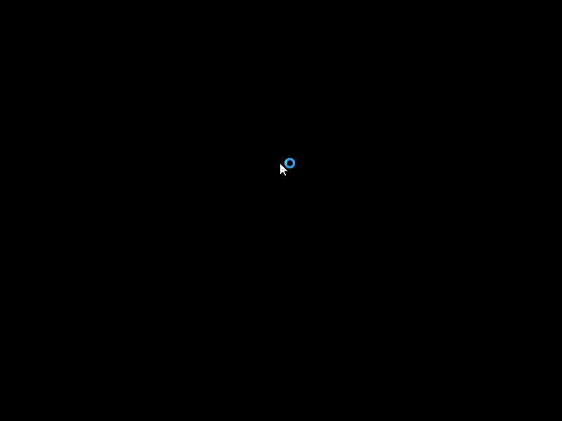
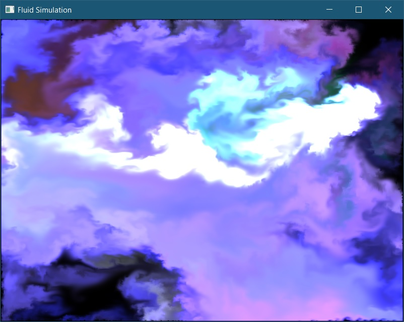
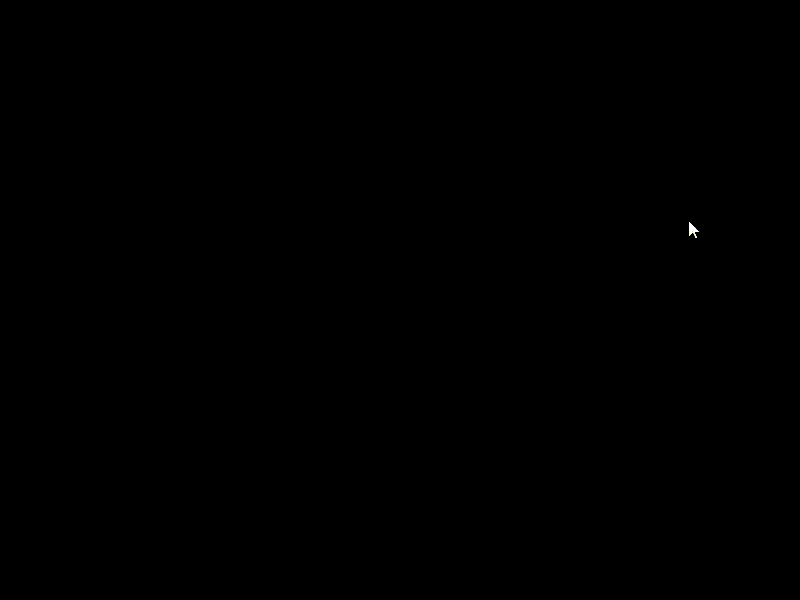

# Fluid-Simulation
OpenGL 2D Fluid Simulation

This is a fluid simulation solving the Navier-Stokes equations for incompressible flow writtin in C++ and OpenGL. 
The simulation is interactable, and runs at around 90 FPS on my GeForce GTX 1660 TI at a 1920 x 1080 simulation resolution, and 164 FPS at a 512 x 512 simulation resolution.
Interacting with the simulation is done by clicking and dragging the mouse, which adds ink and force depending on the position and direction the mouse was moving.

The simulation works in 3 major steps:
- Advection
- Add Forces
- Projection

Since this simulation was focused more on getting visuals for non-viscous fluids such as smoke, the diffusion step was skipped.

# Results

# Advection

The advection step in the simulation is what causes the fluid to move, and is performed on both a velocity texture, advecting itself, and the color texture, which holds values for ink.
Advection was performed with a fragment shader written in GLSL (found in Fluid Simultion/resources/advectionShader.frag). In this case, the shader works by sampling from both a velocity field texture
and a target texture to be advected. The shader first calculates new texture coordinates based on the velocity of the current pixel before writing the value of the target at the curretn texture coordinates
to the new texture coordinates. This results in a moving field as long as there are values to choose from. Implementing only this step (including vorticity) results in the fluid
stopping early as seen below

# Add Forces

This step consists of simply drawing onto the velocity texture at the position of the mouse click, with a color corresponding to the direction the mouse was moving and the forcce parameter.
In other implementations, the force parameter is calculated based on the distance the mouse has moved. However, in this implementation, a constant force value is used that is specified in the 
settings. The force "splat" is drawn onto the velocity texture using another fragment shader (found in Fluid Simulation/resources/splat.frag). This fragment shader works by taking in a position, radius, color, and base,
where the base is the texture to sample from. The shader then simply adds the chosen color in a gaussian distribution around the position with a given radius.

# Projection

The pressure calculation is the most expensive part of this simulation, and works in 3 major steps:
- Divergence Calculation
- Pressure Calculation
- Pressure Gradient Subtraction

## Divergence
The first step, calculating the divergence, is done by sampling from the velocity texture and writing to a temporary texture. And, like the other steps, is done via a fragment shader
(found in Fluid Simulation/resources/divergenceShader.frag). This shader works by using finite differences to calculate the divergence of the given velocity field at a specified pixel.

## Pressure
After the divergence is calculated, the pressure must be calculated next. This is done through jacobi iteration, which is computed with another fragment shader (found in Fluid Simulation/resources/jacobiIterationShader.frag)
over 40 iterations. This shader takes in a constant "b" texture, which in this case is the divergence texture, and a changing "x" texture, which in this case is pressure. This fragment shader is executed n times, and each step depends
on the previous iteration, so the result of the previous iteration must be saved to another texture before beginning the next one.

## Gradient Subtraction
Now that the pressure has been calculated, the gradient of the pressure must be subtracted from the velocity field, so that the velocity field's divergence is back to 0. This is done through one last fragment shader
(found in Fluid Simulation/resources/gradientSubtractionShader.frag). This fragment shader works by simply calculating the gradient of the given field (pressure in this case), and subtracting it from the value of the velocity field.

# Additional Notes

## Vorticity
Vorticity was simple to add to the base program, and was done by simply calculating vorticity and the vorticity force in two separate shaders (found in Fluid Simulation/resources/vorticityGradShader.frag and Fluid Simulation/resources/vorticityShader.frag). An important note is that this will bug out if you do not implement some base boundary conditions (which in my case is that all border pixels are 0). The addition of vorticity results in a more "smokey" looking simulation that can be controlled via the vorticityScale parameter.

# References
- [GPU Gems](https://developer.download.nvidia.com/books/HTML/gpugems/gpugems_ch38.html)
- [Erkaman Github Repo](https://github.com/Erkaman/fluid_sim)
- [Mharrys Github Repo](https://github.com/mharrys/fluids-2d)
- [PavelDoGreat Github Repo](https://github.com/PavelDoGreat/WebGL-Fluid-Simulation)
